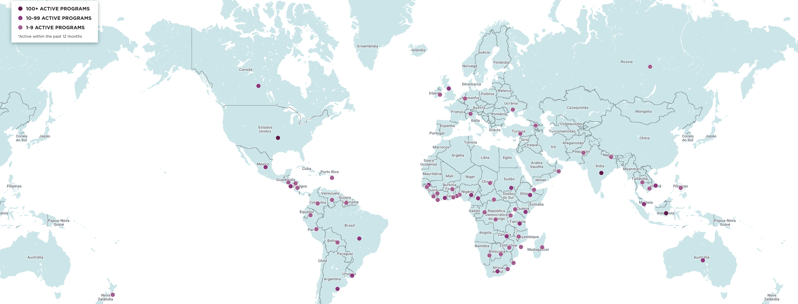

# 🧠 ECHO-UFS - Research & Scientific Computing

<p align="center">
  
  &nbsp;&nbsp;&nbsp;
  
</p>

<p align="center">
  <a href="https://projectecho.unm.edu/">Project ECHO</a> ·
  <a href="https://echoufs.com/">ECHO-UFS</a> ·
  <a href="https://echoufs.blogspot.com/">ECHO-UFS Blog</a> ·
  <a href="https://iecho.org/public/program/PRGM1707459036980LI2A5IWZ6G">iECHO Program Page</a>
</p>

> Research methodology, data analysis, and scientific communication within a multidisciplinary women's health initiative, complemented by an independent scientific-computing notebook for portfolio depth.

**Research Methodology · Data Analysis · Scientific Communication · Python · Statistical Computing**

## Portfolio Scope

This repository presents two related but distinct layers:

| Layer | What It Represents | What It Does Not Claim |
| --- | --- | --- |
| **ECHO-UFS research experience** | Documented participation in a women's health research and training-evaluation context involving methodology, data collection, analysis, and reporting. | It does not claim that neural networks or deep learning were official ECHO-UFS research methods. |
| **Independent technical extension** | A sanitized Jupyter Notebook demonstrating Python-based scientific computing, aggregate data handling, statistical analysis, visualization, and regression-style experimentation. | It is not presented as the official methodology of the ECHO-UFS research project. |

## Program Context

ECHO-UFS - Women's Health in Primary Care was connected to the broader Project ECHO model, which uses remote mentoring and collaborative learning to support professional development in health contexts. The reviewed project materials relate to a remote women's health course evaluation and its research documentation.


The reach graphic is included as institutional/program context for the broader Project ECHO network. It is not used as a measure of my individual impact or of the local ECHO-UFS project.



This active-programs map provides additional context on the international scale of the Project ECHO model. It is included to help readers understand the broader ecosystem in which local ECHO initiatives operate.

## Research Overview

The reviewed files support describing the ECHO-UFS work as a quantitative, descriptive, cross-sectional evaluation of a remote women's health training initiative. The analysis focused on participant perceptions of instructional procedures and knowledge management, including course clarity, methodology, interaction, materials, scientific evidence, and perceived usefulness of knowledge in professional routines.

The public repository intentionally avoids publishing original research datasets, raw spreadsheets, administrative declarations, unpublished drafts, or participant-level information. It presents only aggregate, non-identifiable outputs and portfolio-safe documentation.

## My Documented Role

**Role:** Undergraduate Research Scholar / Scientific Initiation Researcher  
**Project:** ECHO-UFS - Women's Health in Primary Care  
**Institutional context:** Federal University of Sergipe and related project partners

My documented work is represented conservatively:

- Supported the design and preparation of structured research protocols used in the data-collection workflow.
- Collaborated on refinement of research instruments and evaluation materials.
- Supported the application and organization of research data-collection instruments.
- Participated in quantitative data analysis and interpretation of research findings.
- Contributed to written research results, partial documentation, and final reporting materials.
- Supported graphical and audiovisual communication materials connected to the research and training context.
- Participated in research sessions, timelines, training activities, courses, and workshops.

## Research Workflow


## Data And Methodology

The research materials include two evaluation dimensions:

- **Instructional procedure reaction scale:** 15 Likert-style items scored from 0 to 10.
- **Knowledge-management scale:** 6 Likert-style items scored from 1 to 5.

The documented analytical workflow included:

- data organization in spreadsheets;
- descriptive statistics such as mode, mean, median, standard deviation, and quartiles;
- normality review using Kolmogorov-Smirnov tests;
- chi-square tests for response distribution patterns;
- Kruskal-Wallis tests for group-comparison checks;
- Spearman correlation matrices;
- boxplots, heatmaps, and regression-style trend charts;
- written interpretation of results for research reporting.

## Scientific And Analytical Outputs

### Instructional Procedure Evaluation


The instructional procedure scale showed consistently high aggregate scores across the 15 reviewed items. Reported means ranged from **8.66 to 9.45** on a 0-10 scale, with mode equal to 10 across all items in the reviewed table.

### Knowledge Management Evaluation


The knowledge-management scale showed positive aggregate perceptions across the reviewed items. Means ranged from **3.95 to 4.68** on a 1-5 scale, with the strongest averages related to work quality, usefulness, and performance.

### Aggregate Evidence Summary


This summary consolidates the portfolio-safe findings used to explain the analytical workflow. It intentionally avoids individual-level records and restricted datasets.

## Independent Technical Extension

To complement the applied research experience, this repository includes a sanitized notebook:

[notebooks/scientific-computing-extension.ipynb](notebooks/scientific-computing-extension.ipynb)

The notebook demonstrates how the analytical work can be represented through a clean, reproducible scientific-computing workflow using aggregate values only. It was built from the audited technical patterns found in the original notebook while removing raw outputs, local file paths, participant-level previews, and Portuguese-facing text.

**Technical scope note:** The notebook is an independent technical extension of this portfolio. It should not be interpreted as the official methodology of the ECHO-UFS Women's Health in Primary Care research project.

## Notebook Evidence

The reviewed original notebook supported the following technical claims:

| Evidence Found | Public Portfolio Interpretation |
| --- | --- |
| R and Python code cells | Cross-tool analytical workflow experience |
| `pandas`, `NumPy`, `SciPy` | Python-based scientific computing and statistical analysis |
| `matplotlib`, `seaborn`, `ggplot2` | Data visualization and exploratory analysis |
| `scikit-learn` linear models | Regression-style modeling experimentation |
| Chi-square, Kruskal-Wallis, Kolmogorov-Smirnov, Spearman correlation | Statistical testing and survey-analysis workflow |
| Data-cleaning routines and digit extraction | Data preprocessing and transformation |
| Modular Python pipeline pattern | Structured analytical code organization |

The audit did **not** find implemented neural-network architectures such as LSTM, GRU, BI-LSTM, or Simple RNN in the notebook. For that reason, this repository does not present the project as a deep-learning portfolio project.

## Skills Demonstrated

### Research Experience

`Research Methodology` `Quantitative Research` `Data Collection` `Research Protocols` `Data Analysis` `Program Evaluation` `Scientific Communication` `Research Reporting` `Multidisciplinary Collaboration`

### Technical Extension

`Python` `Pandas` `NumPy` `SciPy` `Scikit-learn` `Matplotlib` `Seaborn` `R` `ggplot2` `Data Preprocessing` `Statistical Testing` `Correlation Analysis` `Regression Experimentation` `Scientific Computing`

## Repository Structure

```text
.
├── README.md
├── analysis/
│   └── generate_portfolio_figures.py
├── assets/
│   ├── figures/
│   │   ├── aggregated-analysis-summary.png
│   │   ├── instructional-procedure-scores.png
│   │   └── knowledge-management-scores.png
│   └── images/
│       ├── project-echo-global-reach.png
│       ├── ufs-project-echo-logo.png
│       └── unm-health-sciences-project-echo-logo.png
├── data/
│   └── README.md
├── docs/
│   └── audit-summary.md
├── notebooks/
│   └── scientific-computing-extension.ipynb
└── source-documents/
    └── original-materials/   # local only, excluded from Git
```

## What This Project Demonstrates

- Ability to work inside a real multidisciplinary health-research environment.
- Experience supporting structured research protocols, data collection, and research instruments.
- Ability to organize, analyze, and interpret survey-based quantitative data.
- Familiarity with descriptive statistics, non-parametric tests, and correlation analysis.
- Ability to turn statistical findings into reports, charts, and recruiter-readable technical documentation.
- Responsible handling of sensitive health/research materials.
- Technical curiosity through a separate, sanitized scientific-computing notebook.

## Privacy And Research Ethics

This portfolio presents only non-sensitive aspects of the project. Personal identifiers, confidential documents, participant information, unpublished source documents, raw spreadsheets, administrative declarations, and restricted research data have intentionally been excluded or summarized at an aggregate level.

See [data/README.md](data/README.md) for the data-sharing note and [docs/audit-summary.md](docs/audit-summary.md) for the portfolio audit summary.
