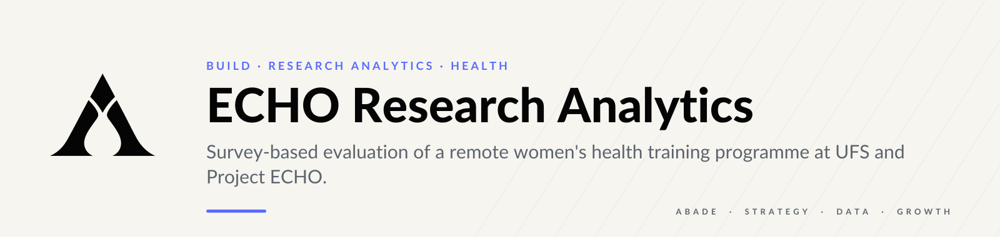
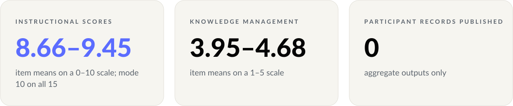
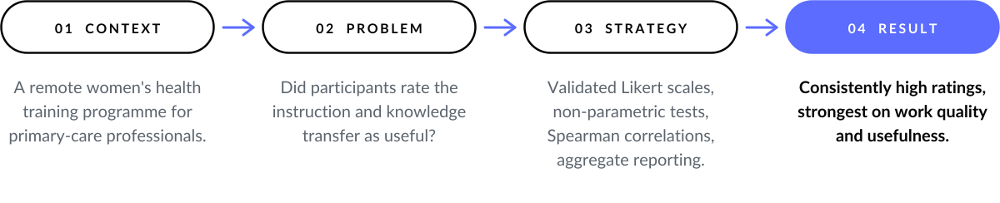
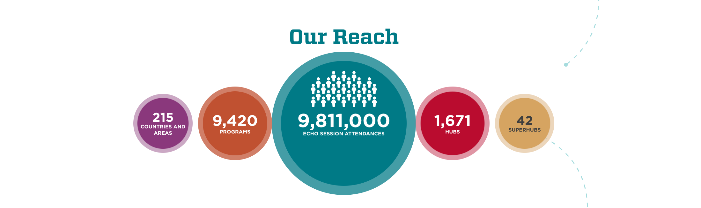
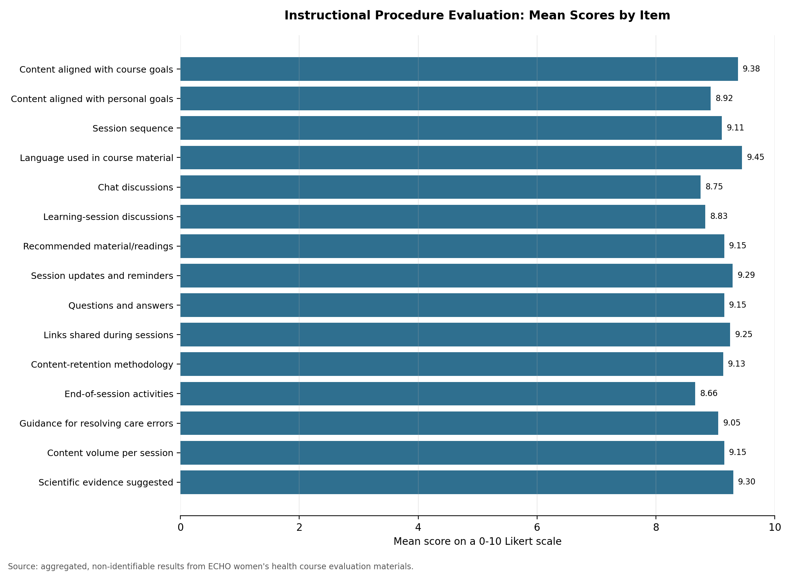
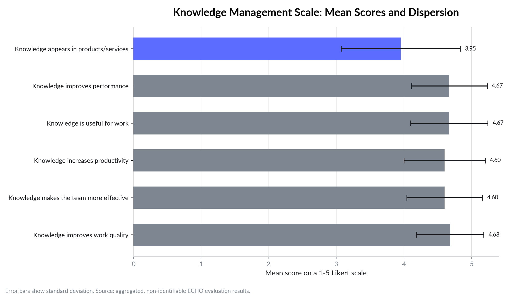
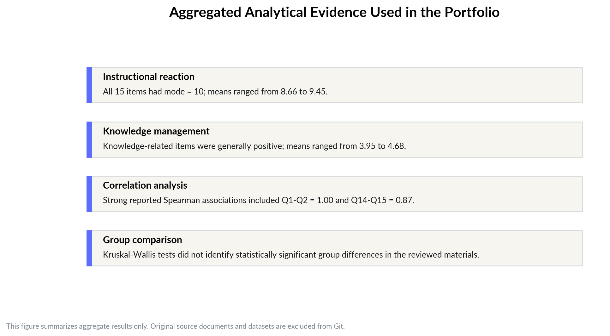

<p align="center">
  <picture>
    <source media="(prefers-color-scheme: dark)" srcset="assets/brand/header-dark.svg">
    
  </picture>
</p>

<p align="center">
  
  
  
  
</p>

**Participants rated a remote women's health training programme consistently high.** Every one of the
15 instructional items had a mode of 10 out of 10. The work behind that result covers protocol design,
data collection, non-parametric statistics and scientific reporting, inside a multidisciplinary
health-research team.

<p align="center">
  <picture>
    <source media="(prefers-color-scheme: dark)" srcset="assets/brand/kpis-dark.svg">
    
  </picture>
</p>

<p align="center">
  <picture>
    <source media="(prefers-color-scheme: dark)" srcset="assets/brand/arc-dark.svg">
    
  </picture>
</p>

---

## 01 — Context

<p align="center">
  
  &nbsp;&nbsp;&nbsp;
  
</p>

**ECHO-UFS – Women's Health in Primary Care** is part of the [Project ECHO](https://projectecho.unm.edu/)
model, which uses remote mentoring and collaborative learning to support health professionals
([ECHO-UFS](https://echoufs.com/) · [blog](https://echoufs.blogspot.com/) ·
[iECHO programme page](https://iecho.org/public/program/PRGM1707459036980LI2A5IWZ6G)).



The reach graphic shows the broader Project ECHO network. It is context, not a measure of the local
project or of my individual impact.

**My documented role.** Undergraduate Research Scholar (Scientific Initiation). I supported research
protocols and instruments, data collection, quantitative analysis and interpretation, written results
and reporting, and graphical communication materials.

---

## 02 — Problem

Did participants perceive the course's instruction (clarity, methodology, interaction, materials,
scientific evidence) and its knowledge transfer as useful in their professional routine?

---

## 03 — Strategy

A quantitative, descriptive, **cross-sectional** evaluation.


| Instrument | Items | Scale |
| --- | --- | --- |
| Instructional procedure reaction | 15 Likert-style items | 0–10 |
| Knowledge management | 6 Likert-style items | 1–5 |

| Method | Purpose |
| --- | --- |
| Mode, mean, median, SD, quartiles | Describe each item |
| Kolmogorov-Smirnov | Check normality, which decides between parametric and non-parametric tests |
| Chi-square | Response distribution patterns |
| Kruskal-Wallis | Group comparisons without assuming normality |
| Spearman correlation | Association between ordinal items |

---

## 04 — Result

<p align="center"></p>

**Instructional procedure:** item means from **8.66 to 9.45** on a 0–10 scale, with a mode of 10 on all
15 items.

<p align="center"></p>

**Knowledge management:** means from **3.95 to 4.68** on a 1–5 scale. The strongest averages were on
work quality, usefulness and performance.

<p align="center"></p>

> **Outcome.** Evidence that participants valued both the instruction and its usefulness at work,
> reported in aggregate and without any individual-level record.

**Independent technical extension.** [`notebooks/scientific-computing-extension.ipynb`](notebooks/scientific-computing-extension.ipynb)
re-expresses the analytical patterns in a clean Python workflow using aggregate values only: pandas,
NumPy, SciPy, visualisation and regression-style experimentation. It is **not** the official
methodology of the ECHO-UFS project. The audit found no neural-network architectures in the original
notebook, so none are claimed.

---

## 05 — Limits and next move

- **Cross-sectional and self-reported.** Perceived usefulness is not measured change in clinical
  practice.
- **Ceiling effects.** With modes at 10, the 0–10 scale has little room to separate strong items from
  very strong ones.
- **Aggregate outputs only.** Original datasets, raw spreadsheets, declarations and participant-level
  information are excluded by design ([data note](data/README.md) · [audit summary](docs/audit-summary.md)).
- **Next move:** a pre/post design with a practice-level outcome, so perceived usefulness can be tested
  against behaviour.

---

## Run it

```bash
git clone https://github.com/arielabade/echo-womens-health-research-analytics
cd echo-womens-health-research-analytics
pip install pandas numpy scipy matplotlib seaborn scikit-learn jupyter

python analysis/generate_portfolio_figures.py           # regenerate the figures from aggregate values
jupyter notebook notebooks/scientific-computing-extension.ipynb
```

## Repository map

```
analysis/     figure generation and brand theme
assets/       figures, programme images and logos
data/         data-sharing note (no raw data)
docs/         portfolio audit summary
notebooks/    sanitised scientific-computing extension
```

---

<p align="center">
  <picture>
    <source media="(prefers-color-scheme: dark)" srcset="assets/brand/track-dark.svg">
    
  </picture>
</p>

<p align="center">
  <a href="https://github.com/arielabade/carbon">← Deep-learning research</a> &nbsp;·&nbsp;
  <a href="https://github.com/arielabade">Portfolio</a>
</p>
